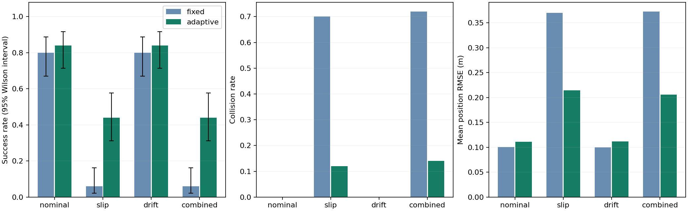

# Results and November audit

## Are the September results valid?

Yes as measurements of this simulator: all 400 published trial rows and the entire summary reproduced exactly from the September implementation. The raw data support the reported success rates, collision counts, RMSE, recovery counts, and successful-trial travel times. The EKF covariance update also passes a numerical transition-Jacobian check. These checks do not establish physical sensor realism or hardware performance.

The audit found two geometry defects. A safe continuous start could be rejected because its grid-cell centre was blocked; for example, (7.9683, 3.525) has the required 0.45 m clearance but could not replan. Also, checking a segment every 0.04 m could miss contact near a corner. New tests reproduce both defects and pass with the fixes.

The controller now approaches within 0.06 m of its estimated goal instead of 0.18 m. This reserves more of the unchanged 0.35 m true-goal tolerance for localization error. The simulator separately reports goal distance and localization error. A floating-point step-count issue at time limits such as 0.3 s was also fixed.

There is no change to the sensor noise, slip schedule, EKF tuning, nominal planning clearance, robot radius, or true-goal success threshold. The collision evaluator is stricter about grazing contact. The [September report](september/results.md) and all six September commits remain available.

## November results on the original seeds

50 seeds (100–149), four scenarios, two policies: 400 trials, each limited to 120 s at 10 Hz. The table reports all trials; time to goal includes successes only.



| Scenario | Policy | September success | November success | Collisions | Position RMSE (m) | Recoveries | Time to goal (s) |
| --- | --- | ---: | ---: | ---: | ---: | ---: | ---: |
| nominal | fixed | 37/50 | 40/50 | 0 | 0.101 | 0.00 | 32.0 |
| nominal | adaptive | 37/50 | 42/50 | 0 | 0.111 | 0.00 | 44.5 |
| slip | fixed | 2/50 | 3/50 | 35 | 0.370 | 0.00 | 32.3 |
| slip | adaptive | 12/50 | 22/50 | 6 | 0.214 | 5.56 | 55.4 |
| drift | fixed | 38/50 | 40/50 | 0 | 0.100 | 0.00 | 32.0 |
| drift | adaptive | 36/50 | 42/50 | 0 | 0.112 | 0.00 | 44.6 |
| combined | fixed | 2/50 | 3/50 | 36 | 0.373 | 0.00 | 32.3 |
| combined | adaptive | 11/50 | 22/50 | 7 | 0.206 | 5.50 | 55.7 |

Adaptive replanning failures fell from 13 to 1 under slip and from 12 to 1 under combined disturbances. The remaining failures are recorded rather than hidden. Average position RMSE increased. That comparison is affected by different trial lengths: failed replans previously ended many traces early, while revised trials continue. These results do not demonstrate an improvement in the EKF itself.

## Fresh-seed validation

Before running validation, the implementation was fixed using the regression tests and development seeds 0–4. Both revisions were then run on seeds 1000–1049: 800 further trials. No parameters were changed after viewing these results. Values below compare September to November within each policy; they do not compare fixed control to adaptive control.

| Scenario | Policy | Success before → after | Collisions before → after | Success change (percentage points) | Paired 95% bootstrap interval |
| --- | --- | ---: | ---: | ---: | --- |
| combined | adaptive | 9/50 → 19/50 | 7 → 8 | +20 | [+10, +30] |
| combined | fixed | 0/50 → 2/50 | 38 → 38 | +4 | [+0, +10] |
| drift | adaptive | 37/50 → 37/50 | 0 → 0 | +0 | [-6, +6] |
| drift | fixed | 37/50 → 37/50 | 0 → 0 | +0 | [-6, +6] |
| nominal | adaptive | 36/50 → 38/50 | 0 → 0 | +4 | [+0, +10] |
| nominal | fixed | 37/50 → 36/50 | 0 → 0 | -2 | [-8, +4] |
| slip | adaptive | 10/50 → 21/50 | 7 → 8 | +22 | [+12, +34] |
| slip | fixed | 0/50 → 1/50 | 37 → 37 | +2 | [+0, +6] |

The fresh-seed adaptive slip success rate rose from 20% to 42%; combined-disturbance success rose from 18% to 38%. Each group also had one additional collision (7 to 8). Continuing trials that previously aborted can create both extra successes and extra collisions. Fixed control on nominal trials fell from 74% to 72%, so the update is not a uniform improvement.

Most disturbed trials still fail. The confidence estimate is heuristic, position remains dead reckoning, and all experiments use one map. Wheel encoders and a gyro cannot provide an absolute position fix; [the ROS state-estimation documentation](https://docs.ros.org/en/kinetic/api/robot_localization/html/state_estimation_nodes.html) describes the corresponding odometry drift. The data are useful for studying this controller, not for claiming robust autonomous navigation.

## Reproduce

```sh
python -m unittest discover -s tests -v
python -m navigation benchmark --trials 50 --seed 100 --output results/november
python -m navigation benchmark --trials 50 --seed 1000 --output results/validation
python scripts/compare_trials.py docs/validation/september/trials.csv results/validation/trials.csv --output results/paired.json
```

For a September rerun, use a separate checkout of commit `c73414e70c92b9e7891ad4932015d1144a6b5ba0` with the same pinned Python environment and seed arguments. The package versions did not change.

Raw records: [November benchmark](benchmark/trials.csv), [its summary](benchmark/summary.json), [paired original-seed comparison](benchmark/paired.json), [September validation](validation/september/trials.csv), [November validation](validation/november/trials.csv), and [paired validation comparison](validation/paired.json). New summaries include source-file hashes and map settings. The audit covered 1,600 full trials: the September replay, the November original-seed run, and both validation runs.

The README demo is nominal/adaptive seed 0: success in 46.0 s, 0.078 m position RMSE, and 0.177 m true final goal distance. All measurements were generated during this reconstruction; November commit dates are assigned historical dates.
